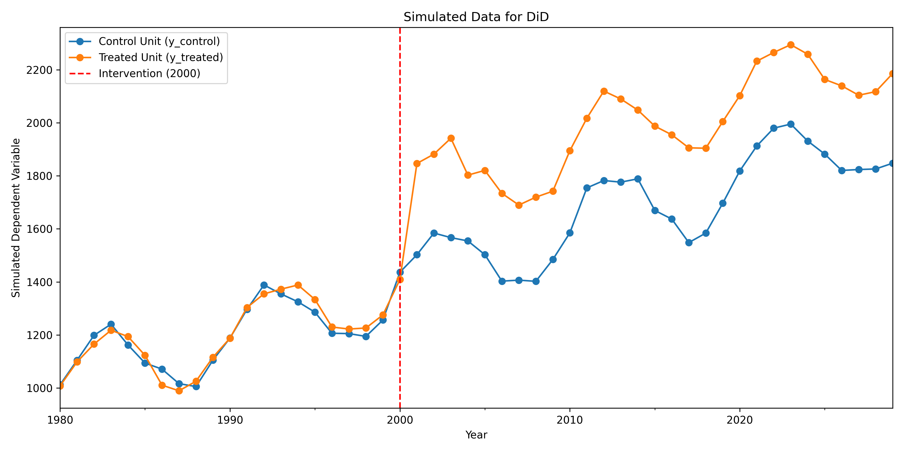
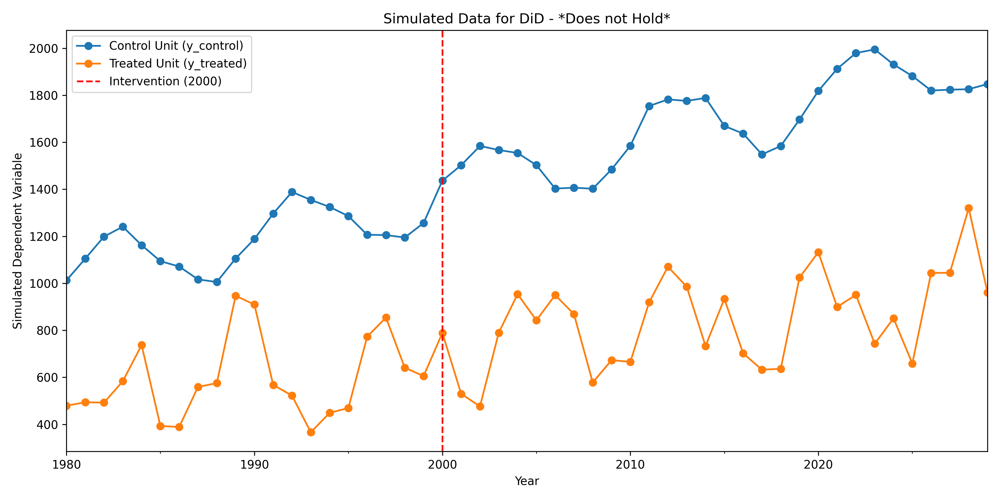

# Double Machine Learning for Difference in Differences: Fundamentals and Applications

**Author**: Martín Gabriel Cargnel

**Director**: Dra. María Noelia Romero

**Universidad de Buenos Aires, Facultad de Ciencias Económicas**

**February 2025**

---

# Abstract

**Abstract**

Machine Learning (ML) models have traditionally been associated with prediction tasks due to their flexibility, while social scientists have typically relied on simpler, often linear, regressions for assessing causality. However, a novel framework named Double Machine Learning (DML) has emerged, providing a way to leverage the predictive performance of these complex methods for robust causal estimation. This thesis examines the fundamentals and applications of double machine learning for two distinct popular Difference-in-Differences (DiD) settings.

**Keywords**: Double Machine Learning, Causal Inference, Difference-in-Differences

---

# Chapter 1: Introduction

As discussed in [@to_explain_or_to_predict], when working in applied statistics there is a clear distinction between predicting and explaining. Prediction is usually associated with achieving the best performance on a selected goodness-of-fit metric, while explaining is focused on understanding the effects or relationships between variables. This distinction makes it clear why flexible, and often considered black-box, Machine Learning (ML) algorithms are widely used when the goal is to achieve the best prediction performance. However, when the goal is to interpret results or to draw causal relationships, other, usually simpler approaches like linear regressions are preferred. This distinction is not new, as it was highlighted by [@breiman_2001], who clearly differentiated between statistics and machine learning when the latter field started to gain popularity.

The focus on prediction and not explanation generated criticism among economists and other social scientists who needed tools for understanding and studying causal relationships, which is not possible with black-box models. However, the new models were appealing, so in recent years, many authors have explored how to bridge this gap. Early work, such as [@varian_2014], highlighted how ML techniques, especially tree-based models, could complement traditional econometric methods in settings with non-linearities and complex interactions. Similarly, [@mullainathan_2017] explored the practical applications of machine learning in econometrics, particularly emphasizing prediction, but also cautioning against drawing causal conclusions about the effects of independent variables without careful consideration.

Although the prevailing view cautioned against using machine learning for explaining, these algorithms gained popularity among researchers over the years. As shown in [@desai_2023], which reviews how ML algorithms are being integrated into economic analysis, this popularity has grown significantly. An attempt to bridge the gap between black-box, prediction-focused machine learning methods and simpler, more interpretable methods was the emergence of interpretable machine learning. There are now several techniques that aim to combine the predictive power of complex, black box machine learning models with methods to interpret them. A comprehensive overview of these techniques can be found in [@molnar2025]. However, it is important to note that many of these methods focus on describing the behavior of the model itself, rather than uncovering the underlying data generating process (DGP) as is common in classical statistics.

While interpretable ML addresses the transparency problem, it does not directly solve the fundamental challenge economists face: estimating causal effects with formal statistical guarantees. What is needed is a framework that uses machine learning not to explain its own predictions, but rather to flexibly control for confounding variables while maintaining the ability to perform valid statistical inference on causal parameters. This work focuses its attention on a particularly influential framework that achieves exactly this: Double Machine Learning (DML) from [@Chernozhukov_2018].

The DML framework provides a general, robust method that formally combines the predictive power of machine learning with the theoretical rigor of causal inference to estimate a specific parameter of interest. Notably, the framework is not restricted to a single econometric setting. It can be adapted to multiple familiar contexts for economists, including Instrumental Variables (IV) estimation, treatment effect models, and, central to this thesis, Difference-in-Differences (DiD) designs.

This document aims to contribute to the growing literature on how to apply these methods in practice, focusing specifically on the application of DML within the DiD framework. By providing both conceptual foundations and practical guidance, this thesis seeks to equip practitioners with the understanding and tools needed to leverage this powerful technique in their own research.

The rest of this document is structured as follows: First, the classic Difference-in-Differences framework and its econometric tools are introduced. Second, the Double Machine Learning (DML) framework is presented along with its specific application for DiD setups. Then, two real-world applications of this algorithm are provided to demonstrate its practical utility, and finally, a conclusion is presented.

---

# Chapter 2: Difference in Differences

Difference in Differences (DiD) is a widely used econometric technique for estimating causal effects when randomized experiments are not feasible. It is particularly useful in policy analysis, economics, and social sciences to evaluate the impact of a treatment or intervention over time. Essentially, the DiD approach compares the changes in outcomes over time between a group that is exposed to a treatment (the treatment group) and a group that is not (the control group). The key idea is to control for unobserved factors that are constant over time and for common trends affecting both groups. An excellent introduction to the method can be found in [@Cunningham_2021].

This chapter begins with the classical Difference in Differences design, lay out identification and estimation in the two period case, move to extensions for staggered adoption, and clarify the role of covariates.

## The DiD Estimator

This section first defines the canonical two group, two period estimator and link it to the Average Treatment Effect on the Treated.

Suppose two groups are observed over two periods: before and after a treatment is implemented. The DiD estimator is calculated as:

$$\hat{\delta}^{t,c} = (Y_{post}^t - Y_{pre}^t) - (Y_{post}^c - Y_{pre}^c)$$

where $Y_{post}^t$ is the average outcome for the treatment group after the intervention, $Y_{pre}^t$ the average outcome for the treatment group before the intervention, $Y_{post}^c$ the average outcome for the control group after the intervention, and $Y_{pre}^c$ the average outcome for the control group before the intervention. This double differencing removes biases from permanent differences between the groups and from trends that affect both groups equally and can be seen as the average treatment effect on the treated, defined as

$$ATT = E[Y^{(1)} - Y^{(0)} | D=1]$$

where $Y^{(1)}$ would be the potential outcome if treated, $Y^{(0)}$ the potential outcome if not treated, and $D\in\{0,1\}$ the treatment indicator, with $D=1$ if treated and $D=0$ if not. So it's the expected treatment effect for the units that actually received the treatment.

In summary, comparing changes across groups recovers the effect on treated units under appropriate assumptions.

### Estimation

An equivalent regression formulation clarifies the interpretation of the interaction coefficient as the Difference in Differences estimand.

DiD models are often estimated using regression analysis, typically with a specification like:

$$Y_{it} = \alpha + \beta \text{Post}_t + \gamma \text{Treat}_i + \delta (\text{Post}_t \times \text{Treat}_i) + \epsilon_{it}$$

where $Y_{it}$ is the outcome for unit $i$ at time $t$, $\text{Post}_t$ an indicator variable that equals 1 if time $t$ is after the treatment, and 0 otherwise, $\text{Treat}_i$ an indicator variable that equals 1 if unit $i$ is in the treatment group, and 0 otherwise, $\delta$ is the DiD estimator (treatment effect), and $\epsilon_{it}$ the error term.

Under the same conditions, this regression delivers the same estimand as the difference in differences formula.

### Assumptions

Next, the identifying requirement is stated and illustrated through an algebraic decomposition and parallel trends plots.

The main identifying assumption of DiD is the parallel trends assumption: in the absence of treatment, the average change in the outcome would have been the same for both groups. If this assumption holds, the DiD estimator provides an unbiased estimate of the treatment effect.

A nice way to see this is by working with the DiD estimator, expanding it to $$\hat{\delta}^{t,c} = (E[Y^{t}|post]- E[Y^{t}|pre]) - (E[Y^{c}|post]- E[Y^{c}|pre])$$

After some algebra, the following expression is obtained: $$\begin{split}
    \hat{\delta}^{t,c} &= (E[Y^{t,1}|post]- E[Y^{t,0}|post]) \\
    &+ (E[Y^{t,0}|post] - E[Y^{t,0}|pre]) - (E[Y^{c,0}|post] - E[Y^{c,0}|pre])
\end{split}$$

In this decomposition, it can be seen that the first term corresponds to the ATT estimator. Please note that the superscripts denote whether the group corresponds to the treated ($t$) or control ($c$), and whether it was treated (1) or not (0).

But the second and third terms cancel out if the parallel trends assumption holds, basically because if the group that received the treatment and the group that didn't receive the treatment would both behave the same in the absence of treatment, then both would be equal before and after the treatment. So the terms would cancel out, and only the ATT would remain.

When pre treatment trends are parallel, the remaining terms cancel and the estimator recovers the Average Treatment Effect on the Treated.

A popular way to validate this assumption is to use a parallel trend plot. This visualization allows for the evaluation of how the dependent variable evolves for the control and treatment groups before and after the treatment. An example with simulated data can be found in Figure (1), where it can be seen that both control and treatment units behave similarly before the treatment (denoted by a vertical red dotted line) but differ after it.

{#fig:sim-parallel-trends width="100%"}

On the other hand, Figure (2) is an example of a plot where the assumption does not hold, because the trends for the two groups are not parallel before the treatment, meaning that the groups are not comparable.

{#fig:sim-not-parallel-trends width="100%"}

## Extension: Staggered DiD

Staggered adoption complicates identification and motivates alternative estimators. This section begins with the standard two way fixed effects specification and then summarizes recent advances that address its limitations.

In many empirical applications, treatments are not implemented at the same time for all treated units. Instead, different units receive the treatment at different points in time; a situation known as staggered adoption. The standard two-period DiD framework does not account for this complexity, so extensions are needed.

### Estimation

The two way fixed effects regression is commonly used for staggered adoption panels.

A common approach is to use a two way fixed effects (TWFE) regression:

$$Y_{it} = \alpha_i + \lambda_t + \delta D_{it} + \epsilon_{it}$$

where $Y_{it}$ is the outcome for unit $i$ at time $t$, $\alpha_i$ are unit fixed effects, $\lambda_t$ are time fixed effects, $D_{it}$ is an indicator for whether unit $i$ is treated at time $t$, and $\delta$ is the average treatment effect.

### Limitations and Recent Advances

Recent research, mainly pioneered by the decomposition demonstrated in [@bacon_2021], has shown that the TWFE estimator can be seen as a weighted average of all potential 2x2 DiD estimates, where weights are based on both group sizes and variance in treatment. However, this decomposition revealed that TWFE can produce biased estimates when treatment effects are heterogeneous across groups or over time in a staggered design. This is because the estimator may compare already treated units to newly treated units, contaminating the control group. Also, it assumes that groups in the middle of the panel should be weighted more than those at the end.

To address these issues, alternative estimators have been developed by different authors. However, in this thesis, the focus will be on the proposal from [@callway_santana_2021], who propose a reliable way to estimate staggered DiD. In sum, while TWFE is convenient, it can be problematic under staggered designs with heterogeneous effects.

## Extensions to Covariates

Finally, this section motivates conditioning on covariates and clarifies when and how to include them in a Difference in Differences design.

The standard parallel trends assumption can be restrictive. In many settings, it may be more plausible to assume conditional parallel trends: the trends between the treated and control groups would be parallel, conditional on a set of covariates $X$.

Including covariates can thus strengthen the validity of the DiD design. In a traditional regression framework, this is done by simply adding the covariates $X_{it}$ to the estimation equation: $$Y_{it} = \alpha + \beta \text{Post}_t + \gamma \text{Treat}_i + \delta (\text{Post}_t \times \text{Treat}_i) + \theta' X_{it} + \epsilon_{it}$$

This model is often estimated as a fixed effects model (similar to the TWFE specification) to control for time invariant unobservables: $$Y_{it} = \alpha_i + \lambda_t + \delta D_{it} + \theta' X_{it} + \epsilon_{it}$$

A limitation of this approach is that it assumes the covariates $X_{it}$ have a linear and additive effect on the outcome $Y_{it}$. If the true relationship is nonlinear or involves complex interactions, this model is misspecified, and the estimate of $\delta$ can be biased.

This limitation provides a key motivation for using machine learning. The Double Machine Learning (DML) framework, as discussed in the next chapter, is designed to overcome this exact problem. It allows for controlling for a rich set of covariates $X_{it}$ in a flexible, nonparametric way, thereby avoiding the biases associated with model misspecification.

However, regardless of the chosen method, the practitioner must be careful when including covariates as this might introduce bias. It is usually recommended to include only time invariant covariates or those that are measured before the treatment takes place. The main risk is that inappropriate covariates might be affected by the treatment, so they would not be a valid control anymore and can be considered colliders, which would introduce bias in the estimation. Taken together, conditioning on covariates can strengthen identification when done carefully, and the next chapter introduces Double Machine Learning to bring flexibility while preserving valid inference.

---

# Chapter 3: Double Machine Learning

## Double Machine Learning Framework

This chapter presents the Double Machine Learning framework introduced by [@Chernozhukov_2018], which provides a rigorous method for combining machine learning flexibility with formal causal inference. The chapter begins by establishing the core framework in a general partially linear model setting, demonstrating how the method addresses key challenges in estimating causal effects when controlling for high-dimensional covariates. It then shows how this framework can be adapted to Difference-in-Differences settings, first in the canonical two-period case and subsequently in the more complex staggered adoption scenario.

The chapter is organized as follows. First, the general DML framework is introduced, starting with the estimation goal and the fundamental confounding problem. The theoretical solution based on orthogonalization is then presented, explaining how machine learning is used in practice to implement this solution. Second, the two critical techniques that ensure valid statistical inference despite using flexible machine learning methods are discussed: cross-fitting and Neyman orthogonality. Finally, this framework is adapted to Difference-in-Differences designs, showing how the core principles apply in both simple and staggered treatment timing contexts.

## The General Framework

### Estimation Goal and Model Setup

The fundamental objective in causal inference is to estimate the causal effect of a treatment $D$ on an outcome $Y$ while properly accounting for a potentially high-dimensional set of covariates $X$. The focus is on estimating a constant treatment effect parameter $\theta$, which represents the Average Treatment Effect (ATE).

$$ATE = E[Y_i(1)-Y_i(0)]$$

Here, $Y_i(1)$ represents the potential outcome for unit $i$ under treatment, while $Y_i(0)$ represents the potential outcome without treatment. The fundamental challenge is that only one of these potential outcomes is observed for each unit, making direct estimation of the ATE impossible without additional structure.

To provide this structure, a Partially Linear Model specification is adopted, which forms the basis for the DML approach:

$$\begin{aligned}
Y_i &= \theta D_i + g(X_i) + \epsilon_i \quad \text{(Outcome Model)} \\
D_i &= m(X_i) + u_i \quad \text{(Treatment Model)}
  \end{aligned}$$

Where $Y_i$ is the observed outcome, $D_i$ is the observed treatment status (e.g., 1 if treated, 0 if not), $X_i$ is a vector of covariates, $\theta$ is the causal parameter of interest (the ATE, assuming a constant effect), $g(X_i)$ and $m(X_i)$ are unknown, potentially complex functions, known as "nuisance functions", that represent how the covariates $X$ affect the outcome and the treatment, respectively, and $\epsilon_i$ and $u_i$ are error terms, which are assumed to be exogenous (i.e., $E[\epsilon_i|X_i, D_i] = 0$ and $E[u_i|X_i] = 0$).

### The Confounding Problem

A naive approach of regressing $Y$ directly on $D$ would yield biased estimates of $\theta$. The source of this bias is confounding: the covariates $X$ simultaneously influence both the treatment assignment through $m(X)$ and the outcome through $g(X)$. This creates a backdoor path from $D$ to $Y$ that runs through $X$, violating the conditions necessary for causal identification.

The structure of this confounding problem can be visualized through a Directed Acyclic Graph:

*[Diagram: Directed Acyclic Graph showing the confounding structure. Covariates X affect both treatment D (through m(X)) and outcome Y (through g(X)), while the causal effect of interest is θ (from D to Y).] Directed Acyclic Graph showing the confounding path. Covariates X affect both treatment D (through m(X)) and outcome Y (through g(X)), while the causal effect of interest is θ (from D to Y).*

Obtaining an unbiased estimate of $\theta$ requires properly controlling for the confounding influence of $X$. The challenge lies in doing so when the functional forms $g(X)$ and $m(X)$ are unknown and potentially complex, making traditional parametric approaches inadequate.

### Theoretical Solution Through Orthogonalization

The DML framework addresses the confounding problem by building on the Frisch-Waugh-Lovell theorem from econometrics.

This theorem demonstrates that estimating a parameter in a multivariate regression can be accomplished by first residualizing all variables with respect to the controls. Applying this principle to our partially linear model yields an estimating equation for $\theta$ that is free from dependence on the nuisance functions $g(X)$ and $m(X)$.

Start with the outcome model: $Y_i = \theta D_i + g(X_i) + \epsilon_i$ and take the conditional expectation of $Y_i$ given $X_i$: $$E[Y_i|X_i] = E[\theta D_i + g(X_i) + \epsilon_i | X_i]$$

Assuming $E[\epsilon_i|X_i]=0$ and since $g(X_i)$ is a function of $X_i$, $E[g(X_i)|X_i] = g(X_i)$:

$$E[Y_i|X_i] = \theta E[D_i|X_i] + g(X_i)$$

This gives us an expression for the confounder $g(X_i)$:

$$g(X_i) = E[Y_i|X_i] - \theta E[D_i|X_i]$$

Now, substitute this expression for $g(X_i)$ back into the original outcome model:

$$Y_i = \theta D_i + (E[Y_i|X_i] - \theta E[D_i|X_i]) + \epsilon_i$$

Finally, rearrange the terms to isolate $Y$ and $D$ from their conditional expectations:

$$Y_i - E[Y_i|X_i] = \theta(D_i - E[D_i|X_i]) + \epsilon_i$$

Let's define our residuals: $\tilde{Y}_i = Y_i - E[Y_i|X_i]$ (The "residualized" outcome) and $\tilde{D}_i = D_i - E[D_i|X_i]$ (The "residualized" treatment). Then our equation becomes:

$$\tilde{Y}_i = \theta \tilde{D}_i + \epsilon_i$$

This transformation represents the central theoretical insight of the framework. The complex partially linear model reduces to a simple linear regression in residualized variables. If the true residuals $\tilde{Y}_i$ and $\tilde{D}_i$ were available, unbiased estimation of $\theta$ would follow directly from regressing $\tilde{Y}$ on $\tilde{D}$. The remaining challenge is that the conditional expectations required to compute these residuals are unknown in practice, motivating the use of machine learning for their estimation.

## Practical Implementation with Machine Learning

The true conditional expectation functions $E[Y|X]$ and $E[D|X]$ are unknown in practice and may exhibit complex, nonlinear relationships with the covariates. The key innovation of Double Machine Learning is to estimate these nuisance functions using flexible machine learning algorithms designed for predictive accuracy.

Specifically, $\hat{l}(X_i)$ is estimated as a machine learning approximation of $E[Y_i|X_i]$, typically framed as a regression task since outcomes are often continuous. Similarly, $\hat{m}(X_i)$ is estimated as an approximation of $E[D_i|X_i]$, which represents the propensity score $P(D_i=1|X_i)$ and is typically framed as a classification task when treatment is binary.

The term "double" in Double Machine Learning refers to this dual use of machine learning: once for modeling the outcome and once for modeling the treatment assignment. The framework is agnostic to the specific machine learning algorithm employed, allowing researchers to use Random Forests, Gradient Boosting, Neural Networks, or any other suitable method depending on the data structure and performance considerations.

The estimated residuals are then computed:

$$\hat{Y}_i = Y_i - \hat{l}(X_i)
\quad \text{and} \quad
\hat{D}_i = D_i - \hat{m}(X_i)$$ And finally, $\theta$ is estimated using the simple linear regression: $$\hat{Y}_i = \theta \hat{D}_i + \hat{\epsilon}_i$$

While this procedure is conceptually straightforward, using machine learning for nuisance function estimation introduces statistical complications that must be addressed to ensure valid inference. The following two subsections explain how the DML framework overcomes these challenges through cross-fitting and Neyman orthogonality.

### Cross-Fitting: Addressing Overfitting Bias

Using the same observations to both train the machine learning models and estimate the final parameter $\theta$ would introduce overfitting bias. The generated residuals would exhibit spurious correlation because the models were optimized using the very same observations for which residuals are being computed.

Cross-fitting solves this problem through sample splitting. The procedure ensures that residuals for any observation are computed using models trained exclusively on different observations, thereby eliminating the overfitting link.

The procedure is most easily understood through a two-fold split, though K-fold cross-fitting generalizes naturally. First, randomly partition the dataset into two equal subsets. Second, train models $\hat{l}_1$ and $\hat{m}_1$ using only the first fold, then use these models to generate residuals for observations in the second fold. Third, train new models $\hat{l}_2$ and $\hat{m}_2$ using only the second fold, then generate residuals for observations in the first fold. Fourth, combine all residuals into a single dataset. Finally, estimate $\theta$ via ordinary least squares regression of $\hat{Y}_i$ on $\hat{D}_i$ using this complete set of residuals. This ensures that no observation contributes to both the training of its prediction model and the final parameter estimation, eliminating overfitting bias.

### Neyman Orthogonality: Addressing Estimation Bias

Machine learning models optimize prediction accuracy rather than unbiased estimation of the true functions $l(X)$ and $m(X)$. Regularization and other aspects of these algorithms inevitably introduce estimation bias in $\hat{l}$ and $\hat{m}$. A critical requirement is that this bias in the nuisance function estimates must not propagate into the final estimate of $\theta$.

Protection against this bias contamination comes from the structure of the estimating equation itself. The equation $\tilde{Y}_i = \theta \tilde{D}_i + \epsilon_i$, derived through the Frisch-Waugh-Lovell approach, possesses a property called Neyman orthogonality. This means the estimate of $\theta$ is first-order insensitive to estimation errors in the nuisance functions. Because both the outcome and treatment have been residualized with respect to their conditional expectations, errors in estimating $l(X)$ and $m(X)$ effectively offset one another, leaving the estimate of $\theta$ asymptotically unbiased.

Neyman orthogonality is the theoretical foundation that enables the DML framework to combine flexible machine learning prediction with rigorous causal inference. It allows researchers to employ powerful but imperfect machine learning models for the nuisance functions while still obtaining statistically valid estimates of the causal parameter $\theta$ with proper asymptotic properties including consistency and asymptotic normality.

Having established the general framework and the techniques that ensure valid inference, the discussion now turns to adapting this approach for Difference-in-Differences settings.

## DML for Difference-in-Differences

The DML framework extends naturally to Difference-in-Differences settings, where the goal is to estimate the Average Treatment Effect on the Treated in panel data with treatment and control groups observed over time. The core principles of orthogonalization, cross-fitting, and Neyman orthogonality remain central, but the specific implementation adapts to the DiD context where identification relies on parallel trends assumptions rather than selection on observables alone.

This section presents two applications of DML to DiD designs. The discussion begins with the canonical two-period case where all treated units receive treatment at the same time. The framework is then extended to handle staggered treatment adoption, where different units may begin treatment at different time periods, addressing the complications this introduces for estimation and aggregation.

### Two-Period Difference-in-Differences

For the canonical DiD setting with a single treatment period, [@chang_2020] developed a doubly robust estimation approach built on a Neyman-orthogonal score function. The framework requires panel data with pre-treatment and post-treatment periods and permits flexible control for covariates through machine learning.

Consider panel data where $Y_{i0}$ denotes the pre-treatment outcome, $Y_{i1}$ denotes the post-treatment outcome, $D_i$ indicates treatment status, and $X_i$ represents a vector of covariates. The Neyman-orthogonal score function for unit $i$ takes the form:

$$\psi_i = \frac{D_i-E[D=1|X]}{E[D](1-(E[D=1|X]))}[(Y_{i1}-Y_{i0})-E[Y_{i1}-Y_{i0}|D=0,X]]$$

The Average Treatment Effect on the Treated is then estimated as the sample average of these individual scores: $$\hat{\psi} = \frac{1}{n} \sum_{i=1}^n \psi_i$$

The score function comprises two multiplicative components. The first is the residualized outcome change: $(Y_{i1} - Y_{i0}) - E[Y_{i1} - Y_{i0} | D=0, X]$. This represents the observed outcome change for unit $i$ minus the predicted outcome change based on the control group's evolution among units with similar covariates. The conditional expectation $E[Y_{i1} - Y_{i0} | D=0, X]$ is a nuisance function estimated via machine learning, capturing the counterfactual trend under parallel trends assumptions adjusted for covariates.

The second component is the propensity score weight: $(D_i - E[D=1|X]) / (E[D] * (1 - E[D=1|X]))$. This reweights observations to account for treatment assignment patterns, using the propensity score $E[D=1|X]$ and the marginal treatment probability $E[D]$. This weighting ensures the score function achieves Neyman orthogonality and provides the doubly robust property: consistency obtains if either the outcome model or the propensity score model is correctly specified.

As in the general DML framework, the nuisance functions must be estimated using cross-fitting to avoid overfitting bias. Specifically, $E[D=1|X]$, $E[D]$, and $E[Y_{i1} - Y_{i0} | D=0, X]$ are estimated on separate folds, and scores are computed using predictions from models trained on different observations.

### Staggered Treatment Adoption

Many empirical applications feature staggered treatment adoption, where different units begin treatment at different time periods. As discussed in the previous chapter, this introduces complications for traditional two-way fixed effects estimators. The DML framework can be extended to handle this setting through the approach developed by [@callway_santana_2021].

The key innovation is to estimate cohort-specific treatment effects $ATT_{g,t}$, where $g$ denotes the cohort defined by the period of initial treatment and $t$ denotes the post-treatment period for which the effect is estimated. For each cohort $g$, treated units are compared against a control group consisting of never-treated and not-yet-treated units. This yields multiple cohort-time specific estimates that must subsequently be aggregated to produce an overall average treatment effect.

Formally, the aggregate ATT is computed as a weighted average:

$$\hat{ATT} = \sum_{g,t} w_{g,t} ATT(g,t)$$

where the weights $w_{g,t}=\frac{N_{g,t}}{\sum_{g',t'}N_{g',t'}}$ reflect the relative size of each cohort-time cell, ensuring that larger groups receive appropriate weight in the aggregate estimate.

#### Doubly Robust Estimation of Cohort Effects

Each cohort-specific effect $ATT(g,t)$ is estimated using a doubly robust approach that combines outcome regression and inverse propensity score weighting:

$$\begin{aligned}
\text{ATT}(g, t) &= \frac{1}{n_g} \sum_{i: G_g = 1} ( Y_{it} - E[Y_t-Y_{g-1}|D=0,X] )\\ &- \frac{1}{n_g} \sum_{i: C = 1} \frac{E[D=1|X]}{1 - E[D=1|X]} ( Y_{it} - E[Y_t-Y_{g-1}|D=0,X])
\end{aligned}$$

Here, $G_i = g$ identifies units in cohort $g$ (those first treated at time $g$), $C = 1$ identifies control units (never-treated or not-yet-treated at time $t$), and $n_g$ denotes the cohort size. The notation can be simplified by defining $\hat{\mu}_0(X_i, t) = E[Y_t-Y_{g-1}|D=0,X]$ and $\hat{p}_g(X_i) = E[D=1|X]$.

The nuisance function $\hat{\mu}_0(X_i, t)$ represents the machine learning estimate of the expected outcome at time $t$ for a unit with covariates $X_i$ had it remained in the control state, estimated using observed control group outcomes. The nuisance function $\hat{p}_g(X_i)$ represents the probability that a unit with covariates $X_i$ belongs to treatment cohort $g$ rather than the control group.

The estimator has two components. The first averages the difference between observed outcomes and predicted counterfactual outcomes across treated cohort $g$ units. The second applies inverse propensity score weighting to the control group, with weights $\frac{\hat{p}_g(X_i)}{1 - \hat{p}_g(X_i)}$ that rebalance the control group to match the covariate distribution of the treated cohort.

Double robustness ensures consistent estimation if either the outcome model $\hat{\mu}_0(X, t)$ correctly predicts untreated outcomes or the propensity score model $\hat{p}_g(X)$ correctly predicts cohort membership. As with all DML applications, these nuisance functions must be estimated using cross-fitting to maintain valid inference properties.

#### Event Study Aggregation

While the weighted average aggregation described above produces a single summary measure of the treatment effect, researchers often want to understand how effects evolve over time relative to treatment adoption. Event study aggregation addresses this by organizing cohort-time effects according to *relative time* $e = t - g$, where $e$ represents the number of periods before ($e < 0$) or after ($e \geq 0$) initial treatment.

For each event time $e$, the event study estimator aggregates across all cohorts that contribute an observation at that relative time:

$$ATT(e) = \sum_{g} w_g^e \cdot ATT(g, g+e)$$

where $w_g^e = \frac{N_g}{\sum_{g'} N_{g'}}$ weights each cohort by its relative size among cohorts observed at event time $e$. This produces a sequence of estimates $\{ATT(e)\}$ for $e \in \{e_{min}, \ldots, -1, 0, 1, \ldots, e_{max}\}$.

The event study representation serves two important purposes. First, estimates for $e < 0$ (pre-treatment periods) provide a diagnostic check of the parallel trends assumption. If the identifying assumption holds, one expects $ATT(e) \approx 0$ for all $e < 0$, since treatment has not yet occurred. Significant pre-treatment effects suggest potential violations of parallel trends. Second, estimates for $e \geq 0$ reveal the dynamic path of treatment effects, showing whether impacts are immediate or gradual, persistent or transitory.

This event study structure is particularly valuable for policy evaluation, as it allows researchers to assess both the validity of the identification strategy and the temporal pattern of causal effects within a unified framework.

This completes our presentation of the DML framework and its application to Difference-in-Differences settings. The following chapter demonstrates these methods using real empirical applications.

---

# Chapter 5: Applications

This chapter presents two comparative applications to illustrate how DML estimators compare against traditional estimators for Difference-in-Differences (DiD). Two distinct settings are examined: first, a canonical case where treatment was implemented at a single point in time, and second, a staggered adoption setting where treatment was adopted in different periods. For the first case, the analysis from [@gonzales_2025] is replicated, which estimates the effect of fracking on environmental regulatory activities using a classic DiD approach. In this setting, significant differences between the methods are not expected because of the number of variables included and the unbiased estimator chosen by the author. In the second case, the impact of Castle Doctrine laws on homicide rates [@cheng_2013] is analyzed, a well-known example in the literature that highlights the limitations of traditional Two-Way Fixed Effects (TWFE) estimators in staggered adoption designs.

In both applications, several iterations of the DML DiD estimators are run with different random seeds to ensure stability in the estimates, and average results across runs are reported.

## Difference-in-Differences with Treatment in One Period

The analysis begins by reproducing the results from [@gonzales_2025], specifically the initial sections where the author uses the Difference-in-Differences (DiD) method for estimating the effect of fracking on environmental regulatory activities. The dataset contains 143,275 observations from fracking wells at the zip-code-year level. The data focuses on states where the fracking boom was more pronounced: Arkansas, Louisiana, North Dakota, Oklahoma, Pennsylvania, Texas, and Virginia. In the original paper, three different dependent variables are used, all measured at the zip-code-year level: (1) Actions, the total number of environmental activities; (2) Facilities, the total number of facilities that received at least one regulatory action; and (3) Formal, the total number of formal environmental activities.

### Replication of Gonzales

The author also included county-level employment and total establishments as control variables. These variables serve as proxies for local economic activity and help isolate the impact of fracking on regulation. It is important to note that while the original paper presented estimations both with and without controls, the focus is only on reproducing the estimations that include controls.

More formally and following the structure from the paper, the Two-Way Fixed Effects (TWFE) estimation equation can be expressed as: $$\begin{aligned}
\log(1+y_{it}) &= \alpha + \delta \, \text{fracked}_i + \gamma \, \text{Post 2005}_t \\
&\quad + \theta\, (\text{fracked}_i times \text{Post 2005}_t) + v X_{it} + \mu_i + \nu_t + \epsilon_{it}
\end{aligned}$$

where $i$ represents zip codes and $t$ represents years. The dependent variable $y$ it is the log-transformed outcome, using the $log(1+y_{it})$ transformation to accommodate zero values for Actions, Facilities, and Formal. Following the notation from previous chapters, our coefficient of interest is $\theta$, which represents the DiD estimate, $X$ it is a vector of control variables (employment and establishments). $\mu_i$ and $\nu_t$ represent zip-code and year fixed effects, respectively. Finally, $\epsilon$ it is the error term. Standard errors are clustered at the zip-code level, the unit at which treatment was assigned. While the model estimates all the parameters described above, our focus is on $\theta$, as the other terms (including the main effects $fracked_i$ and $Post_{2005t}$) serve to isolate the causal effect.

As the specification shows, the treatment $Post_{2005t}$ occurred in the same year (2005) for all treated zip codes. This date was chosen as it marks when technological advancements made fracking broadly profitable. This scenario represents a classic Difference-in-Differences (DiD) setup, for which the Two-Way Fixed Effects (TWFE) specification above is appropriate.

### Double Machine Learning

With this setup, the discussion now turns to the Double Machine Learning approach. The DML DiD estimator, as formally introduced in a previous chapter, is applied to estimate the causal effect of fracking on regulatory activities in the non energy sector. Following [@chang_2020], the DML estimator was adapted to the DiD setting with a single treatment period. The critical difference between PanelOLS (TWFE) and DML DiD is in how covariates $X$ are handled. PanelOLS assumes a linear and additive relationship between controls and the outcome. DML DiD makes no such assumption and instead uses flexible machine learning to capture potentially nonlinear and interactive relationships between controls and outcomes.

As described in the previous chapter, estimating the Average Treatment Effect on the Treated requires nuisance functions obtained via cross fitting. Based on the score function for the ATT, the following functions are estimated using gradient boosting trees: (1) the outcome model $g_\theta(X) = E[Y_{i1} - Y_{i0} | D = 0, X]$ predicts the change that a unit would have experienced without treatment based on covariates $X$. This flexibly models parallel trends conditional on $X$ and (2) the treatment model (propensity score) $m(X) = E[D = 1 | X]$ predicts the probability that a unit belongs to the treatment group given its covariates.

Given the different nature of the nuisance functions, a regression model is used for $g$ (because the outcome change is numeric) and a classification model for $m$ (because treatment is binary). Concretely, LightGBM [@lightgbm_2017] is employed, an efficient implementation of gradient boosting trees [@friedman_2001] that supports both tasks in a unified framework. This tree based, nonparametric method builds decision trees sequentially, with each new tree trained to correct the residuals of the previous one. To mitigate overfitting, a shrinkage parameter (learning rate) regulates the contribution of each tree.

LightGBM was chosen for its strong predictive performance and computational efficiency. For reference, training the two models with cross fitting took about fourteen seconds on a MacBook Air M3 with twenty four gigabytes of memory. In this implementation, default hyperparameters from the library performed well, and robustness checks with alternative settings did not yield materially different results.

A further advantage is that gradient boosting trees do not perform explicit variable selection. As noted by [@wuthrich_zhu_2023], methods like Lasso may drop covariates under strong penalization. While acceptable for pure prediction, this can be problematic in causal settings if important controls are removed, leading to biased nuisance function estimates and, in turn, biased treatment effect estimates. Using trees avoids dropping included controls and reduces this risk.

### Comparing results

The results of both estimations are compared in Figure (1) and a table with all the results can be found in the appendix [\[tab:model-comparison-a\]](#tab:model-comparison-a){reference-type="ref" reference="tab:model-comparison-a"}. Both estimators yield nearly identical results, with point estimates that are positive and statistically significant across all three outcomes. For Actions, TWFE estimates a coefficient of 0.089 while DML yields 0.088. For Facilities, both methods produce an estimate of 0.086. For Formal activities, TWFE estimates 0.091 and DML estimates 0.090. The confidence intervals are also nearly overlapping across all specifications.

This similarity is expected and instructive for two reasons. First, treatment occurs in a single period for all treated units. In this canonical DiD setting, TWFE is known to provide unbiased estimates of the average treatment effect on the treated under the parallel trends assumption. There is no staggered adoption that could introduce the negative weighting problems documented in recent DiD literature. Second, the specification includes only two control variables: county-level employment and total establishments. With such a parsimonious set of covariates, there is limited scope for complex nonlinear or interactive relationships that might be better captured by machine learning methods. The linear specification used in TWFE appears adequate for modeling how these controls relate to the outcome.

The close agreement between TWFE and DML serves as a valuable validity check. It confirms that both approaches appropriately handle this standard DiD design and that the DML implementation is working as intended. Importantly, this result also establishes a baseline for the subsequent staggered adoption analysis, where the methods are expected to diverge. The contrast between the single-period and staggered settings will illustrate when flexible machine learning methods and robust DiD estimators provide meaningful advantages over traditional TWFE specifications.

![Treatment effect estimates for the impact of fracking on environmental regulation outcomes using TWFE (blue) and DML (orange) estimators. Point estimates and 95 percent confidence intervals are shown for three outcomes: Actions (total regulatory activities), Facilities (facilities receiving actions), and Formal (formal enforcement activities). All outcomes use log transformations. Both estimators yield nearly identical results, with point estimates that are positive and statistically significant across all three outcomes.](./images/model_comparison.png){#fig:model-comparison width="100%"}

## Staggered difference in differences

This section presents an application in a staggered adoption setting where the treatment is implemented in different periods for different units. The impact of Castle Doctrine laws on homicide is analyzed, a well-known example in the literature that highlights the limitations of traditional Two-Way Fixed Effects (TWFE) estimators in staggered adoption designs.

The dataset contains anual data from 2000 to 2010 for all states in the US. The treatment variable indicates whether a state has implemented a Castle Doctrine law in a given year. Castle Doctrine laws, which expand the right to use deadly force in self-defense within one's home, were adopted by various states at different times during the study period. This staggered adoption creates a complex treatment landscape that challenges traditional DiD methods.

That is why this section compares the traditional TWFE estimator with the DML DiD estimator adapted for staggered adoption settings. The goal is to assess how each method estimates the causal effect of Castle Doctrine laws on homicide rates, considering the potential biases introduced by staggered treatment timing.

### Two-Way-Fixed-Effects

The traditional TWFE model for this staggered adoption setting can be specified as follows:

$$y_{it} = \beta_1 \, \text{CastleDoctrine}_{it} + \beta_2 X_{it} + \mu_i + \nu_t + \epsilon_{it}$$

where $y_{it}$ represents the homicide rate in state $i$ at time $t$, $\text{CastleDoctrine}_{it}$ is a binary indicator of whether the Castle Doctrine law is in effect, $X_{it}$ represents a vector of control variables, $\mu_i$ and $\nu_t$ are state and year fixed effects, respectively, and $\epsilon_{it}$ is the error term. The coefficient $\beta_1$ captures the average treatment effect of the Castle Doctrine laws on homicide rates.

This is a classic TWFE specification, but as highlighted in recent literature, it may produce biased estimates in staggered adoption settings due to the presence of negative weights and heterogeneous treatment effects. However, is important to notice that when the authors originally analyzed this data, the limitations of TWFE in staggered settings were not yet widely recognized and this model was commonly used. Besides, authors included several robust check s to validate their results.

### Double Machine Learning

To address the potential biases of the TWFE estimator in this staggered adoption context, the Double Machine Learning (DML) DiD estimator adapted for staggered treatments is applied. This approach allows for flexibly modeling the relationships between covariates and outcomes while accounting for the complex treatment timing.

Following the framework introduced in a previous chapter, the necessary nuisance functions are estimated using Random Forest [@breiman2001a]to capture nonlinearities and interactions among covariates. Once again, given that Random Forest does not select variables, the potential biases that other methods might have are avoided. The key nuisance functions include: (1) the outcome model $g_\theta(X) = E[Y_{it} | D_{it} = 0, X]$, which predicts the potential outcome without treatment based on covariates $X$, and (2) the treatment model (propensity score) $m(X) = E[D_{it} = 1 | X]$, which estimates the probability of treatment given covariates.

With this setup, unbiased estimates of the Average Treatment Effect on the Treated (ATT) in this staggered adoption setting can be presented, mitigating the biases associated with traditional TWFE methods.

### Comparing results

Figure (2) compares the estimated effects of Castle Doctrine laws on homicide rates using both the traditional TWFE estimator and the DML DiD estimator adapted for staggered adoption settings. The results reveal notable differences between the two methods. The TWFE estimator with the defined specificaction showed a positive but non significant effect of Castle Doctrine laws on homicide rates, with a point estimate close to zero and wide confidence intervals that include zero. This is not consistent to the findings from [@cheng_2013], where the author found a significant increase in homicides after the implementation of Castle Doctrine laws. This discrepancy is attributed to the limitations of TWFE in staggered settings, as is known to produce biased estimates under such conditions, potentially obscuring true treatment effects under certain specifications.

{#fig:comparison-castle width="100%"}

On the other hand, the DML DiD estimator produced a positive and statistically significant effect at 1%, with a point estimate indicating an increase in homicide rates following the implementation of Castle Doctrine laws. The confidence intervals for the DML estimate were narrower and did not include zero, suggesting a more precise estimation of the treatment effect. This findings aligns more with the literature that suggests Castle Doctrine laws may lead to higher homicide rates, buts showing a stronger effect than previously reported. This effect can be attributed to the DML DiD estimator's ability to flexibly model covariates relationships and properly account for the staggered treatment timing, reducing potential biases present in the TWFE approach. The divergence in results between the TWFE and DML DiD estimators underscores the importance of choosing appropriate methods for causal inference in staggered adoption settings.

Another interesting result emerges when the event study analysis is added to the comparison. This approach allows for assessing the parallel trends assumption and examining the dynamic evolution of treatment effects. Under the parallel trends assumption, statistically insignificant estimates in the pre-treatment periods are expected, followed by significant effects in the post-treatment periods if a causal impact exists.

Table (1) presents the dynamic treatment effects of Castle Doctrine laws on log homicide rates relative to the year of adoption, estimated using the Double Machine Learning DiD approach. Statistically significant coefficients at -6 and -1 years prior to adoption are observed. While significant pre-trends can challenge the validity of the design, it is worth noting that these estimates do not exhibit a systematic trend (e.g., a monotonic divergence). Instead, they fluctuate around zero, suggesting that these significance levels may be driven by specific year-state shocks or noise rather than a fundamental violation of the parallel trends assumption. The significant coefficient at $t=-1$ might also reflect anticipation effects, where behavior changes shortly before the law's enactment.

Focusing on the post-treatment period, a consistent pattern is observed: significant positive effects emerge at $t=0$ and persist in subsequent years (1, 2, and 4 years post-adoption). Unlike the pre-period fluctuations, the post-treatment coefficients are consistently positive, reinforcing the main DML DiD finding that Castle Doctrine laws are associated with an increase in homicide rates.

  Years          Coef       Std. Err.   $2.5\%$   $97.5\%$
  ---------- ------------- ----------- --------- ----------
  -7 years      -0.069        0.110     -0.289     0.147
  -6 years    0.253\*\*\*     0.114      0.044     0.476
  -5 years      -0.015        0.070     -0.151     0.123
  -4 years      -0.028        0.067     -0.160     0.103
  -3 years       0.008        0.061     -0.105     0.127
  -2 years       0.057        0.051     -0.046     0.157
  -1 years    -0.113\*\*      0.054     -0.223     -0.006
  0 years      0.120\*\*      0.046      0.016     0.211
  1 years       0.122\*       0.061     -0.002     0.242
  2 years       0.144\*       0.075     -0.003     0.291
  3 years        0.113        0.081     -0.049     0.272
  4 years      0.165\*\*      0.078      0.011     0.318

  : Event Study Results for Chapter 4: Dynamic treatment effects of Castle Doctrine laws on log homicide rates by years relative to adoption. Estimates from Double Machine Learning DiD with 95% confidence intervals. Significant pre-trends and post-treatment effects are marked with asterisks: \* p\<0.10, \*\* p\<0.05, \*\*\* p\<0.01.

Although the pre-treatment period exhibits some volatility, the structural break in coefficients following adoption suggests a meaningful impact of Castle Doctrine laws. The sustained increase in homicide rates post-treatment aligns with theoretical expectations and corroborates prior empirical findings. Furthermore, the robustness of the overall DML DiD estimate, which aggregates these dynamic effects, supports the conclusion of a positive causal effect. While the pre-trends warrant a cautious interpretation, the contrast between the noisy pre-period and the consistently positive post-period provides evidence that the laws contributed to higher homicide rates. Future research could explore additional robustness checks or alternative specifications to further validate these findings.

---

# Chapter 6: Conclusion

This thesis has explored the integration of Double Machine Learning (DML) techniques within the Difference-in-Differences (DiD) framework, assessing their potential to enhance causal inference in econometric analyses. By leveraging the predictive power of machine learning algorithms while preserving the interpretability of traditional econometric parameters, DML offers a robust alternative for researchers navigating complex, high-dimensional data settings.

The empirical applications provided a comparative analysis of DML-DiD against traditional Two-Way Fixed Effects (TWFE) estimators. In the canonical single-period treatment setting (fracking regulation), both methods yielded nearly identical results. This suggests that when the data generating process is relatively simple and the set of controls is small, traditional linear specifications remain adequate. However, in the more complex staggered adoption setting (Castle Doctrine laws), the methods diverged significantly. While TWFE failed to detect a significant effect, the DML-DiD estimator uncovered a positive and statistically significant impact on homicide rates. This contrast highlights the specific value of DML: its ability to flexibly model nonlinear nuisance functions and handle complex treatment dynamics where rigid linear assumptions may fail.

These findings underscore that while DML is not a panacea, it is a critical tool for modern applied econometrics, particularly when theoretical guidance on functional forms is limited. Nevertheless, as noted by [@pritchett_2024], methodological sophistication cannot substitute for external validity or a deep understanding of the institutional context. DML should therefore be viewed not as a replacement for economic intuition, but as a powerful complement that improves the precision and credibility of causal estimates within a well-defined identification strategy.

---

# Appendix

Model              Dep. Var.     Coef.    $CI_{low}$   $CI_{high}$
  ------------------ ------------ -------- ------------ -------------
  Classic DiD        Actions       0.2287     0.1954       0.2621
  Classic DiD        Facilities    0.1589     0.1362       0.1815
  Classic DiD        Formal        0.2092     0.1714       0.2470
  DML (Chang 2020)   Actions       0.2333     0.2003       0.2663
  DML (Chang 2020)   Facilities    0.1609     0.1385       0.1833
  DML (Chang 2020)   Formal        0.2062     0.1689       0.2434

  : Model Comparison Results for Chapter 2: Classical Difference-in-Differences versus Double Machine Learning estimates (Chang 2020 methodology) for three dependent variables: Actions, Facilities, and Formal employment, showing coefficients and 95% confidence intervals.

  Model     Dep. Var.        Coef       $CI_{low}$   $CI_{high}$
  ------- -------------- ------------- ------------ -------------
  TWFE     Log homicide      0.087        -0.032        0.206
  DML      Log homicide   0.130\*\*\*     0.036         0.222

  : Model Comparison Results for Chapter 4: Two-Way Fixed Effects (TWFE) versus Double Machine Learning DiD estimates for the Castle Doctrine's effect on log homicide rates. DML estimates show statistical significance at the 1% level (\*\*\*), while TWFE estimates are not statistically significant.

---

